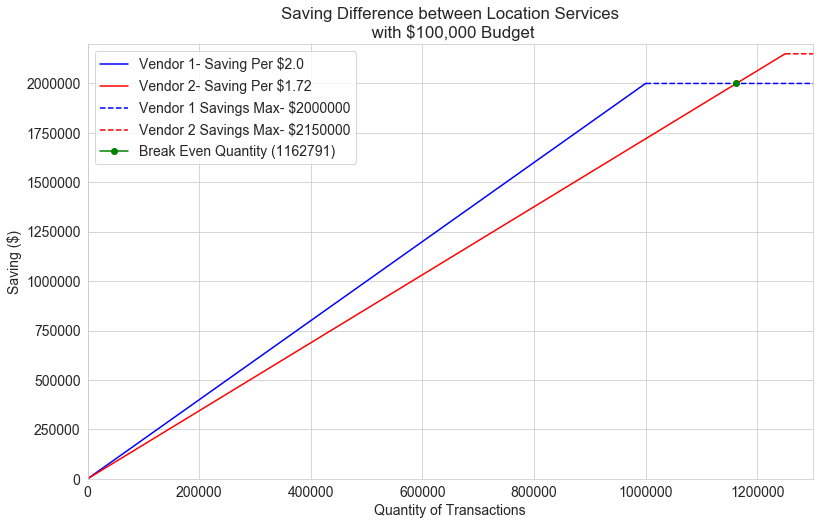

### Business Case Interview - Data Analyst

The business case is centered on a bank in particularly tracking customer transactions. Each transaction has a description which is indecipherable like the below. These unhelpful descriptions don't provide customers useful information and can lead to confusion. This confusion leads to calls to the bank's customer service line that lead to increase cost to the company.

```ESBFRN.COM ABBOTS LANGL GBR ```

There are 2 vendors for a lookup function that converted the description into two more helpful point with the vendor providing:
<ul>
  <li>Accuracy business description</li>
  <li>Location Information (City, State,...)</li>
</ul> 

Each corrected description will lead to a 20% decrease in the cost of a customer service call associated with a transaction ($15.00). 

Vendor 1 provides:

<ul>
  <li>$0.10 per lookup cost</li>
  <li>70% accuracy of lookup</li>
</ul> 

Vendor 2 provides:

<ul>
  <li>$0.08 per lookup cost</li>
  <li>60% accuracy of lookup</li>
</ul> 

#### Question 

What is the break even quantity of lookups between Vendor 1 and Vendor 2? 

    

**Unforntunately I was not able to answer the question correct in the interview, but I decided to work it out  anyway.**

First I calculated the savings generated per use of each vendor option. Then I subtracted the cost of the options per lookup to find the net savings rates. The rate for Vendor 1 is 2.00 dollars and for Vendor 2 is 1.72 dollars. The below equations display the calculations.


$$ SavingPerLookup = AccuracyLookup * PercentSavedPerLookup *  CustomerServiceCostPerTransaction$$

$$ SavingRate = SavingPerLookup - CostPerLookup$$


Using these saving rates, I generated a graph of the savings generated per transactions. With a 100,000 dollars budget, Vendor 1 and Vendor 2 max out their savings at 1,000,000 and 1,250,000 lookups respectively). The budget is fixed so the quantities above maximum lookups for vendor option have fixed savings. Vendor 1 is 2,000,000 dollars, and Vendor 2 is 2,150,000 dollar. See the graph to see the overall relationship.



The maximum saving for option 2 was higher that option 1 by 150,000 dollars because the additional 250,000 lookups that could be performed for the budget. Although Vendor 1 has greater savings up to the breakeven point which can be seen in the graph. I found the breakeven quantity, 1,162,791 transactions, by dividing the Vendor 2 saving rate (1.72 dollars) by the 2,000,000 dollars savings limit of Vendor 1. See the green dot on the graph at the intersection of the Vendor Saving lines.

**I did not realized that the budget was fixed , and  I was incorrectly trying to optimize the budget instead of finding the breakeven quantity. Unfortunately I didn't realize my mistake until my interviewer had to  correct me.**

**I also incorrectly thought the quantity could not go pass the budgeted number of lookups. This can be seen in the graph represented by solid and dashed proportions of the plotted lines.  It is visually apparent in the graph, but the graph was not available in the interview, and I had problems visualizing the scenario. I didn't realize there was a difference between the number of lookups (solid lines) that can be done and amount transactions can be done (solid and dashed lines)..** 