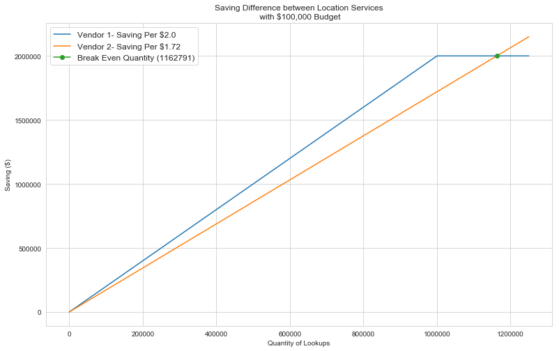

### Business Case Interview - Data Analyst

The business is centered of a bank and tracking customer transactions. Each transaction has a description  which indistinguishable like the below. 

```ESBFRN.COM ABBOTS LANGL GBR ```

There are 2 vendors for a location lookup function that converted the description into a something useful. The vendor will provide: 
<ul>
  <li>Accuracy business description</li>
  <li>Location Information (City, State,...)</li>
</ul> 

Each corrected description will lead to 20% decrease  in the cost of a customer service call associated with a transaction ($15.00). 

Vendor 1 provides:

<ul>
  <li>$0.10 per lookup cost</li>
  <li>70% accuracy of lookup</li>
</ul> 

Vendor 2 provides:

<ul>
  <li>$0.08 per lookup cost</li>
  <li>60% accuracy of lookup</li>
</ul> 

#### Question 

What is the break even quantity of lookups between Vendor 1 and Vendor 2? 


```python
#Vendor 1 stats
p1=0.1 # price per lookup ($)
acc1 = 0.7 # accuracy 

#Vendor 2 Stats
p2 = 0.08# price per lookup($)
acc2= 0.6 # accuracy 

#Savings percent on call for correct lookup ($)
sr= 0.2

# Price of CS call ($)
call_price= 15


# Saving per call ($)
sav1 = acc1* sr* call_price - p1 #Vendor 1 savings per lookup 
sav2= acc2* sr* call_price - p2 #Vendor 2 savings per lookup


budget = 100000
end_quantity = int(budget/p2)
quantity = [int(i) for i in range(0,end_quantity)]
savings1 = [sav1*i if i*p1<budget else sav1*(budget/p1) for i in range(0,end_quantity)]
savings2 = [sav2*i if i*p2<budget else sav2*(budget/p2) for i in range(0,end_quantity)]


import matplotlib.pyplot as plt
import seaborn as sns
sns.set_style("whitegrid")


plt.figure(figsize=(13,8))
# plotting Vendor 
plt.plot( quantity, savings1, label= f'Vendor 1- Saving Per ${round(sav1, 2)}') 
plt.plot(quantity, savings2, label= f'Vendor 2- Saving Per ${round(sav2, 2)}')

#plotting Break Even Quantity
plt.plot(sav1*(budget/p1)/sav2, sav1*(budget/p1), marker='o', 
         label = f'Break Even Quantity ({round(sav1*(budget/p1)/sav2)})')

plt.title('Saving Difference between Location Services\n with $100,000 Budget')
plt.xlabel('Quantity of Lookups')
plt.ylabel('Saving ($)')
plt.rcParams.update({'font.size': 12})
plt.legend();

```


```python
# Saving per call ($)
sav1 = acc1* sr* call_price - p1 #Vendor 1 savings per lookup 
sav2= acc2* sr* call_price - p2 #Vendor 2 savings per lookup

budget = 100000
end_quantity = int(budget/p2)
quantity = [int(i) for i in range(0,end_quantity)]
savings1 = [sav1*i if i*p1<budget else sav1*(budget/p1) for i in range(0,end_quantity)]
savings2 = [sav2*i if i*p2<budget else sav2*(budget/p2) for i in range(0,end_quantity)]

import matplotlib.pyplot as plt
import seaborn as sns
sns.set_style("whitegrid")

plt.figure(figsize=(13,8))
# plotting Vendor 
plt.plot( quantity, savings1, label= f'Vendor 1- Saving Per ${round(sav1, 2)}') 
plt.plot(quantity, savings2, label= f'Vendor 2- Saving Per ${round(sav2, 2)}')

#plotting Break Even Quantity
plt.plot(sav1*(budget/p1)/sav2, sav1*(budget/p1), marker='o', 
         label = f'Break Even Quantity ({round(sav1*(budget/p1)/sav2)})')

plt.title('Saving Difference between Location Services\n with $100,000 Budget')
plt.xlabel('Quantity of Lookups')
plt.ylabel('Saving ($)')
plt.rcParams.update({'font.size': 12})
plt.legend();

print(f"Saving Rate for Vendor 1 is ${round(sav1,2)}0.\nSaving Rate for Vendor 2 is ${round(sav2,2)}.")
print(f"With a $100,000 Budget, lookups with Vendor 1 is {round(budget/p1)} and lookups with Vendor 1 is {round(budget/p2)}.")
print(f'Break Even Quantity-{round(sav1*(budget/p1)/sav2)}')
```

    Saving Rate for Vendor 1 is $2.00.
    Saving Rate for Vendor 2 is $1.72.
    With a $100,000 Budget, lookups with Vendor 1 is 1000000 and lookups with Vendor 1 is 1250000.
    Break Even Quantity-1162791
    




